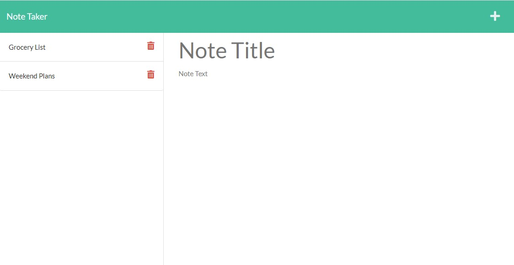

# Note Taker

## Table of Contents

- [Usage](#usage)
- [What I Learned](#what-i-learned)
- [Questions](#questions)

## Description

This is a challenge assignent for UofU that introduces us to express.js using GET and POST. The end result is a page that the user can add notes to a pre set up front end called Note Taker that then gets added to our set up .json file.

  

## Usage

This is an app that will accept and save notes. The user can click the plus sign in the upper right corner to add a custom note. They may then fill in the Title to call it what they want and fill the Text area with the main subject of ther note. Afterwards you can click on the save icon which will add it to the list on the left. Once there you can click on a Title box on the left to then get a better look at the note.

## What I Learned

This go around we learned about Express.js, GET ans POST. As my seventh JavaScript project I found this to still be a challenge. The biggest issue this go around was getting my head around how to get the server set up and all the new lingo that comes with it. As always I will keep pushing forward in an attempt to grow and improve.

## Questions

<a href="https://github.com/JohnKnee3">JohnKnee3's GitHub</a>

If you want to contact me please send me an email at john.a.clark3@gmail.com and I will get back to you as soon as possible.
